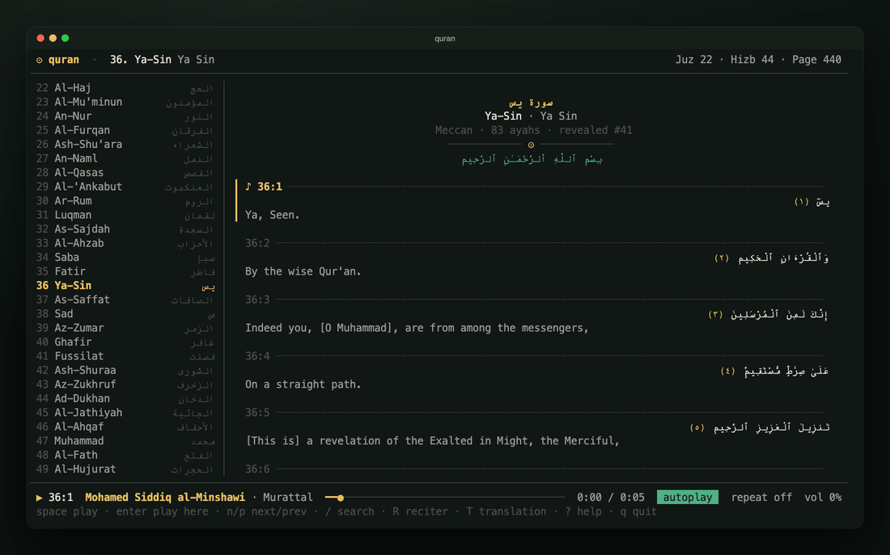
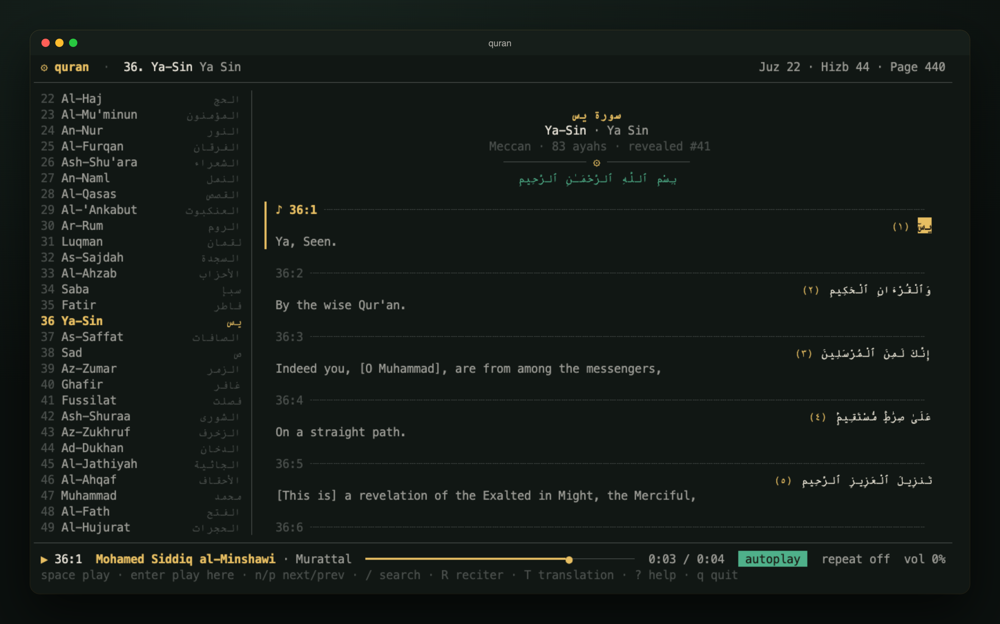
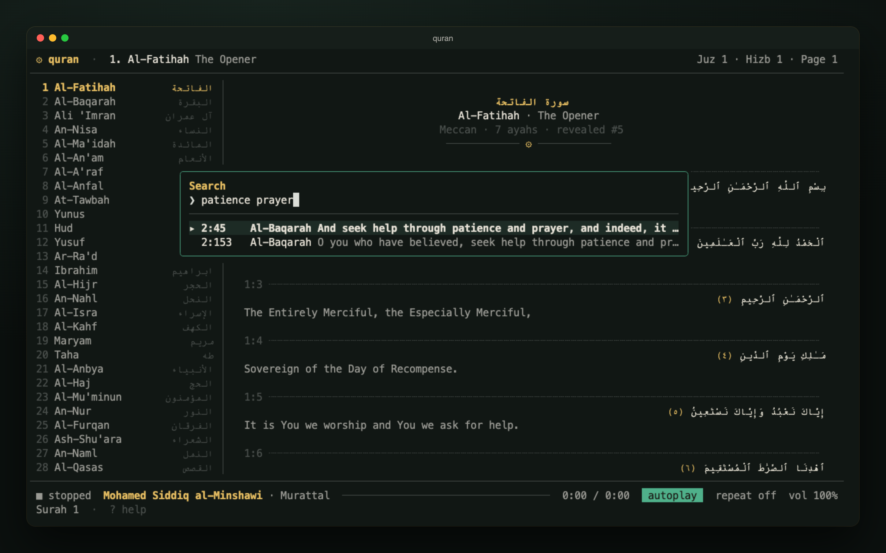
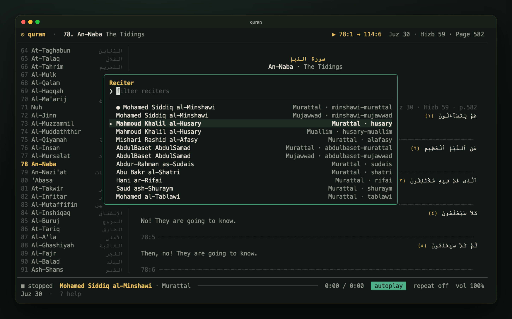
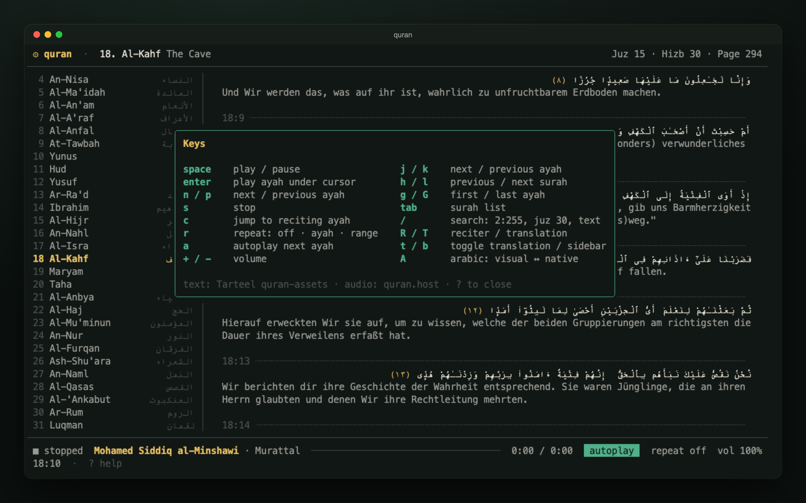
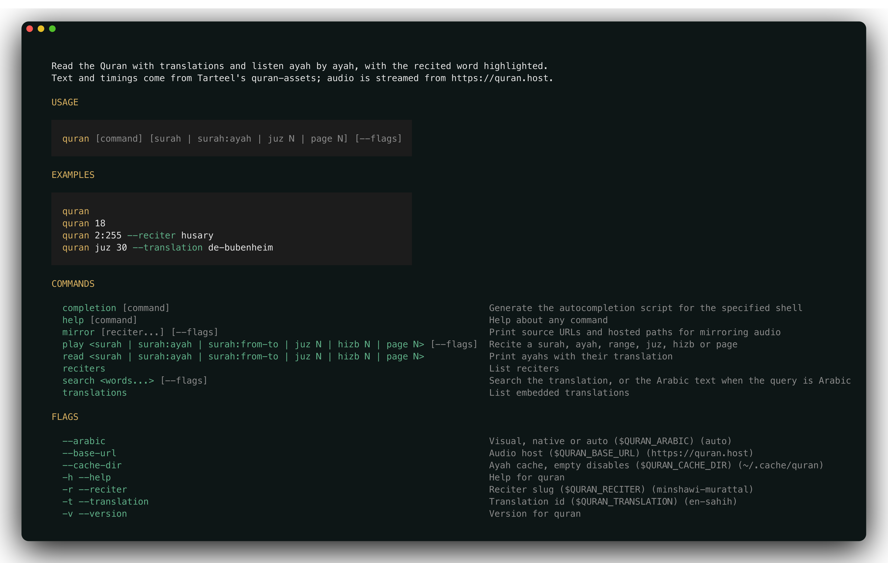
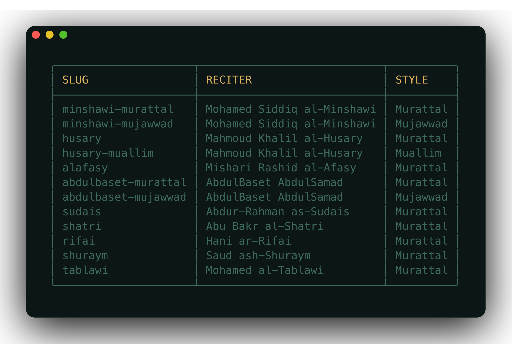
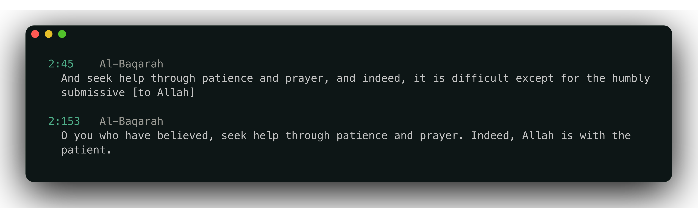

<div align="center">

# ۞ quran

**Read and listen to the Quran in your terminal.**
Twelve reciters, word-by-word highlighting, 35 translations, one static binary.

[](go.mod)
[](https://charm.land)
[](https://quran.host)
[](https://github.com/TarteelAI/quran-assets)



[quran.host](https://quran.host) · [Install](#install) · [Usage](#usage) · [Keys](#keys) · [How it works](#how-it-works)

</div>

---

## Features

- 🎧 **Ayah-by-ayah recitation** with the current word highlighted in gold, basmala before every surah opener, autoplay across surahs, and repeat by ayah or by range.
- 🕌 **12 reciters**: Minshawi (murattal, mujawwad), Husary (murattal, muallim), Alafasy, AbdulBaset (murattal, mujawwad), Sudais, Shatri, Rifai, Shuraym and Tablawi. All of them have word timings.
- 🌍 **35 translations** across 26 languages, including a transliteration and two Arabic tafsirs, embedded in the binary. Switch while reading.
- 🔎 **One search box** for `2:255`, `2:255-257`, `juz 30`, `hizb 5`, `page 604`, `kahf`, `الكهف`, or any words in the translation or the Arabic text.
- 🔤 **Readable Arabic in any terminal**: letters are shaped and reordered for terminals without bidi; terminals that have it (iTerm2 3.6+, Terminal.app, Konsole, GNOME Terminal) get logical text laid out so their own bidi cannot pull the sidebar or ayah numbers into the Arabic.
- 📦 **No runtime dependencies**: pure Go, no cgo. Text and timings are compiled in; audio streams from [quran.host](https://quran.host) and is cached after the first play.

## Screenshots

<table>
  <tr>
    <td width="50%"><br><sub><b>Reader</b>: sidebar, surah banner, recited word highlighted</sub></td>
    <td width="50%"><br><sub><b>Search</b>: references, surah names and full text</sub></td>
  </tr>
  <tr>
    <td><br><sub><b>Reciters</b>: switch mid-recitation; juz 30 bounds the playback range</sub></td>
    <td><br><sub><b>Keys</b>: with the Bubenheim German translation</sub></td>
  </tr>
</table>

## Install

```sh
go install github.com/4thel00z/quran@latest
```

or from a checkout:

```sh
git clone https://github.com/4thel00z/quran && cd quran
make build   # → bin/quran
```

## Usage

```sh
quran                                  # open the reader at Al-Fatihah
quran 18                               # Al-Kahf
quran play 36                          # open Ya-Sin and start reciting
quran play 2:255 -r husary             # Ayat al-Kursi by Husary
quran play juz 30 --no-tui             # recite juz 30, printing each ayah
quran read 1 -t de-bubenheim           # print Al-Fatihah with a translation
quran search patience prayer           # every word must appear
quran search الحي القيوم                 # Arabic queries ignore diacritics
quran reciters && quran translations
quran font install                     # install Amiri Quran & Scheherazade New
```

<p align="center"></p>

<table>
  <tr>
    <td width="50%"></td>
    <td width="50%"></td>
  </tr>
</table>

### Options

| Flag | Env | Default |
|---|---|---|
| `-r, --reciter` | `QURAN_RECITER` | `minshawi-murattal` |
| `-t, --translation` | `QURAN_TRANSLATION` | `en-sahih` |
| `--arabic` | `QURAN_ARABIC` | `auto` (`visual` or `native`) |
| `--base-url` | `QURAN_BASE_URL` | `https://quran.host` |
| `--cache-dir` | `QURAN_CACHE_DIR` | the OS cache dir + `/quran` |

If Arabic looks mirrored or its words are scrambled, your terminal applies bidi itself: use `--arabic native`. If its letters are unjoined or in the wrong order, use `--arabic visual`. Press `A` in the reader to toggle.

### Fonts & Terminal Setup

For optimal Quranic Arabic typography in your terminal, install the curated font bundle (**Amiri Quran** and **Scheherazade New**):

```sh
quran font install
```

To verify installed fonts and view terminal fallback configuration snippets for Kitty, WezTerm, Alacritty, Ghostty, and others:

```sh
quran font status
```

## Keys

| | Playback | | Navigation |
|---|---|---|---|
| `space` | play / pause | `j` `k` | next / previous ayah |
| `enter` | play the ayah under the cursor | `h` `l` | previous / next surah |
| `n` `p` | next / previous ayah | `g` `G` | first / last ayah |
| `s` | stop | `tab` | surah list |
| `c` | jump to the ayah being recited | `/` | search |
| `r` | repeat: off · ayah · range | `R` `T` | reciter / translation |
| `a` | autoplay | `t` `b` | toggle translation / sidebar |
| `+` `-` | volume | `A` | Arabic: visual ↔ native |

## How it works

```
TarteelAI/quran-assets ──┐
quran.com word timings ──┼─ tools/gen ─▶ internal/assets/data/*.json.gz ─▶ go:embed
                         │
verses.quran.com, ───────┴─ quran mirror ─▶ deploy/mirror.sh ─▶ quran.host/audio/<reciter>/SSSAAA.mp3
everyayah mirror
```

| Package | Role |
|---|---|
| `internal/quran` | data model, reference resolver, search |
| `internal/assets` | embedded text, translations and timings |
| `internal/arabic` | contextual shaping, lam-alef ligatures, visual reordering |
| `internal/render` | right-to-left line layout for both modes |
| `internal/font` | Quran font bundle installer and terminal fallback guidance |
| `internal/audio` | fetch + cache, playback through [beep](https://github.com/gopxl/beep) |
| `internal/tui` | the [Bubble Tea](https://github.com/charmbracelet/bubbletea) reader |
| `internal/cmd` | [Cobra](https://github.com/spf13/cobra) commands run through [Fang](https://github.com/charmbracelet/fang) |

Word timings are `[firstWord, lastWord, startMs, endMs]` per ayah. The reader polls the player every 50 ms and highlights the word whose interval contains the audible position. Tests check that every reciter's timings index into the embedded words.

### Hosting the audio

`quran.host` is plain Caddy over a directory (`deploy/Caddyfile`). `make mirror` prints every upstream URL with its hosted path and runs `deploy/mirror.sh` on the server: 8 parallel curls, skipping files that already exist, so reruns are safe. All 12 reciters are 74,832 files.

```sh
make assets ASSETS=../quran-assets   # regenerate embedded data
make test
make mirror SERVER=you@host WEBROOT=path/to/site
```

## Credits

- Text, metadata and Alafasy timings: [TarteelAI/quran-assets](https://github.com/TarteelAI/quran-assets) and the [Quranic Universal Library](https://qul.tarteel.ai). The Quran text comes from Tanzil (CC BY 3.0).
- Translations: [Tanzil](https://tanzil.net/trans/); each translation has its own terms.
- Word timings for the other reciters: [quran.com API](https://api-docs.quran.com).
- Recordings: [verses.quran.com](https://quran.com) and [everyayah](https://everyayah.com), mirrored on quran.host.
